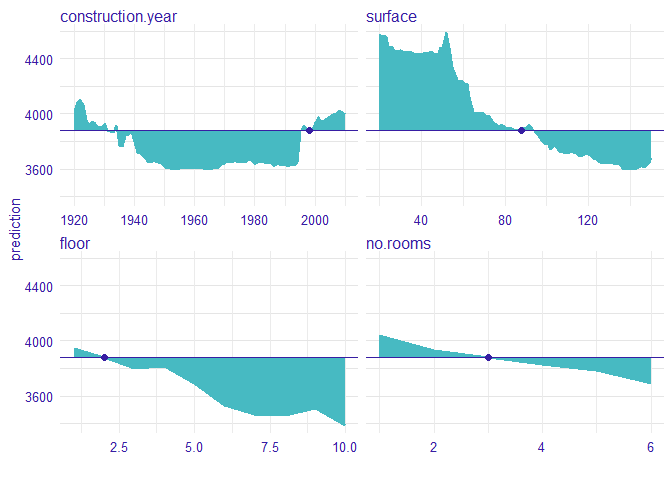

The vivo package - variable importance measure based on Ceteris Paribus profiles
==================================================================================================================

[](https://travis-ci.org/MI2DataLab/vivo/)
[](https://codecov.io/gh/MI2DataLab/vivo)

This package is a tool to calculate variable importance. The measure is based on Ceteris Paribus plot and is calculated in eight variants. We obtain eight variants measure through the possible combinations of three parameters such as `absolute_deviation`, `point` and `density`.

Installation
------------

``` r
install.packages("devtools")
library("devtools")
install_github("MI2DataLab/vivo")
```

Intuition
---------

Ceteris Paribus is a latin phrase meaning „other things held constant” or  „all else unchanged”. Ceteris Paribus Plots show how the model response depends on changes in a single input variable, keeping all other variables unchanged. They work for any Machine Learning model and allow for model comparisons to better understand how a black model works.

The measure is based on Ceteris Paribus profiles oscillations. In particular, the larger influence of an explanatory variable on prediction at a particular instance, the larger the deviation along the corresponding Ceteris Paribus profile. For a variable that exercises little or no influence on model prediction, the profile will be flat or will barely change. 


Let consider an example

#### 1 Dataset

We work on Apartments dataset from `DALEX` package.

```r
library("DALEX")
data(apartments)
```

#### 2 Build a model

We define a random forest regression model.

```r
library("randomForest")
#model
apartments_rf_model <- randomForest(m2.price ~ construction.year + surface + floor +
                                      no.rooms, data = apartments)
#explainer from DALEX
explainer_rf <- explain(apartments_rf_model,
                        data = apartmentsTest[,2:5], y = apartmentsTest$m2.price)
```

#### 3 Ceteris Paribus profiles

Now, we calculate Ceteris Paribus profiles for new observation.

```r
new_apartment <- data.frame(construction.year = 1998, surface = 88, floor = 2L, no.rooms = 3)

library("ingredients")
#calculate ceteris paribus profiles
profiles <- ceteris_paribus(explainer_rf, new_apartment)

#plot ceteris paribus
plot(profiles) + show_observations(profiles)
```


#### 4 Measure based on Ceteris Paribus profiles

The value of the colored area is our measure. The larger the area, the more important is the variable.




We calculated measure with `absolute_deviation`, `point` and `density` parameters equal to true. This means that the deviation is calculated as a distance from observation, not from the average. Measure is weighted based on the density of variable and we use absolute deviation. 


```r
library("vivo")

#calculate measure with all parameter are true
measure <- local_variable_importance(profiles, apartments, absolute_deviation = TRUE, point = TRUE, density = TRUE)

plot(measure)
```


For the new observation the most important variable is surface, then floor, construction.year and no.rooms.


References
----------

-  [Ceteris Paribus Plots](https://github.com/pbiecek/ceterisParibus)

The package was created as a part of master's diploma thesis at Warsaw University of Technology at Faculty of Mathematics and Information Science by Anna Kozak.
