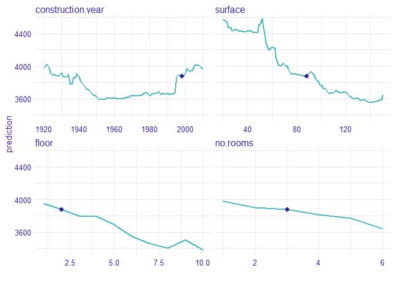
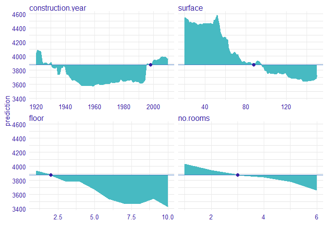
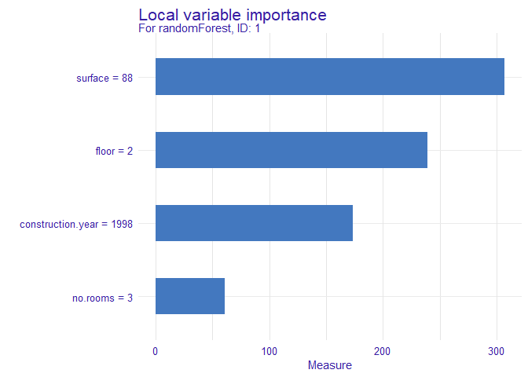

# Variable importance measure based on Ceteris Paribus profiles 

[](https://cran.r-project.org/package=vivo)
 [](https://travis-ci.org/ModelOriented/vivo)
[](https://codecov.io/github/ModelOriented/vivo?branch=master)
[](http://drwhy.ai/#eXtraAI)

## Overview

This package helps to calculate instance level variable importance
(local sensitivity). The importance measure is based on Ceteris Paribus
profiles and can be calculated in eight variants. Select the variant
that suits your needs by setting parameters: `absolute_deviation`,
`point` and `density`.

`vivo` is a part of [DrWhy](https://github.com/ModelOriented/DrWhy)
collection of tools for Visual Exploration, Explanation and Debugging of
Predictive Models.

## Installation

From CRAN

``` r
install.packages("vivo")
```

From GitHub

``` r
install.packages("devtools")
devtools::install_github("ModelOriented/vivo")
```

## Intuition

Ceteris Paribus is a latin phrase meaning „other things held constant”
or „all else unchanged”. Ceteris Paribus Plots show how the model
response depends on changes in a single input variable, keeping all
other variables unchanged. They work for any Machine Learning model and
allow for model comparisons to better understand how a black model
works.

The measure is based on Ceteris Paribus profiles oscillations. In
particular, the larger influence of an explanatory variable on
prediction at a particular instance, the larger the deviation along the
corresponding Ceteris Paribus profile. For a variable that exercises
little or no influence on model prediction, the profile will be flat or
will barely change.

Let consider an example

#### 1 Dataset

We work on Apartments dataset from `DALEX` package.

``` r
library("DALEX")
data(apartments)
```

#### 2 Build a model

We define a random forest regression model.

``` r
library("randomForest")
#model
apartments_rf_model <- randomForest(m2.price ~ construction.year + surface + floor +
                                      no.rooms, data = apartments)
#explainer from DALEX
explainer_rf <- explain(apartments_rf_model,
                        data = apartmentsTest[,2:5], y = apartmentsTest$m2.price)
```

    ## Preparation of a new explainer is initiated
    ##   -> model label       :  randomForest  (  default  )
    ##   -> data              :  9000  rows  4  cols 
    ##   -> target variable   :  9000  values 
    ##   -> model_info        :  package randomForest , ver. 4.6.14 , task regression (  default  ) 
    ##   -> predict function  :  yhat.randomForest  will be used (  default  )
    ##   -> predicted values  :  numerical, min =  2085.883 , mean =  3514.857 , max =  5329.799  
    ##   -> residual function :  difference between y and yhat (  default  )
    ##   -> residuals         :  numerical, min =  -1244.621 , mean =  -3.333807 , max =  2156.984  
    ##   A new explainer has been created! 

#### 3 Ceteris Paribus profiles

Now, we calculate Ceteris Paribus profiles for new observation.

``` r
new_apartment <- data.frame(construction.year = 1998, surface = 88, floor = 2L, no.rooms = 3)

library("ingredients")
#calculate ceteris paribus profiles
profiles <- ceteris_paribus(explainer_rf, new_apartment)

#plot ceteris paribus
plot(profiles) + show_observations(profiles)
```

<!-- -->

#### 4 Measure based on Ceteris Paribus profiles

The value of the colored area is our measure. The larger the area, the
more important is the variable.

<!-- -->

We calculated measure with `absolute_deviation`, `point` and `density`
parameters equal to true. This means that the deviation is calculated as
a distance from observation, not from the average. Measure is weighted
based on the density of variable and we use absolute deviation.

``` r
library("vivo")

#calculate measure with all parameter are true
measure <- local_variable_importance(profiles, apartments,
                                     absolute_deviation = TRUE, point = TRUE, density = TRUE)

plot(measure)
```

<!-- -->

For the new observation the most important variable is surface, then
floor, construction.year and no.rooms.

## References

  - [Ceteris Paribus Plots](https://github.com/pbiecek/ceterisParibus)

The package was created as a part of master’s diploma thesis at Warsaw
University of Technology at Faculty of Mathematics and Information
Science by Anna Kozak.
